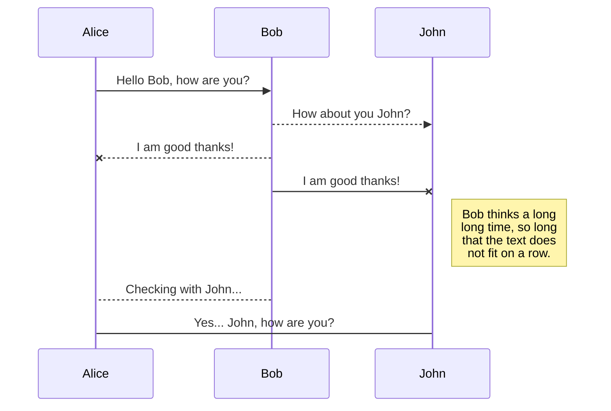
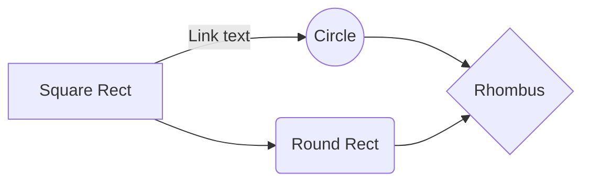

# mesa-minimal-git builder script

Building [mesa-git](https://aur.archlinux.org/packages/mesa-git)/[mesa-minimal-git](https://aur.archlinux.org/packages/mesa-minimal-git) on Arch is suggested to be done manually rather than using an AUR helper. You should start by reading the pinned comments at the AUR page for mesa-git. You will get the idea why it is being done this way.

This guide explains how the so called [clean chroot](https://wiki.archlinux.org/title/DeveloperWiki:Building_in_a_clean_chroot) has to be configured, how a [local repository for pacman](https://wiki.archlinux.org/title/Pacman/Tips_and_tricks#Custom_local_repository) should be made, provides a simple build script and maybe even some compiled packages.

Both AURs mesa-git and mesa-minimal-git are provided by the same maintainer. Idea behind mesa-minimal-git is to compile only the needed drivers.

Will be providing two scripts. One compiles mesa-minimal-git as is. The other will compile only the bare-minimum for AMD-GPUs.

Before running this script you will need (**only once!**) to set the **chroot** and the **local repo**. The first two steps here will explain doing just that:

# Setting up chroot

### Setting up a chroot
The chroot is like a mini Arch install. We will be building the packages in it. It helps us with dependency issues and insures proper compiles.

> The [devtools](https://archlinux.org/packages/?name=devtools) package
> provides tools for creating and building within clean chroots. Install
> it if not done already.

 To make a clean chroot, create a directory in which the chroot will
 reside. For example, `$HOME/chroot`.

Now here the Arch wiki has us creating the folder of the chroot in our home folder. We will call the folder **`.chroot`** instead of **`chroot`** to have it hidden.

 `mkdir ~/.chroot`

 Define the `CHROOT` variable:

 `$ CHROOT=$HOME/.chroot`
 Now create the chroot
`$ mkarchroot $CHROOT/root base-devel`

Define the `CHROOT` variable in `$HOME/.bashrc`. Put `export CHROOT=$HOME/.chroot` in it and reboot / log-out.

Adjust the mirrorlist in `$CHROOT/root/etc/pacman.d/mirrorlist` and enable the [multilib] repo.
 `$ nano $CHROOT/root/etc/pacman.conf`

 While we are here, lets edit makepkg to make sure it doesn't build us debug packages (judging by you reading this guide, you won't need them :P)
`$ sudo nano $CHROOT/root/etc/makepkg.conf`
Search for **!debug**

A bit below it you will see `OPTIONS=(strip docs !libtool !staticlibs emptydirs zipman purge debug lto)` , put an **!** before **debug** :

    OPTIONS=(strip docs !libtool !staticlibs emptydirs zipman purge !debug lto)

## Creating local repository

All you need to do is edit **/etc/pacman.conf**. Our repo will be named **repo-mesa-minimal-git**.
Edit ending of **pacman.conf** to resemble:

    # An example of a custom package repository. See the pacman manpage for
    # tips on creating your own repositories.
    [mesa-minimal-git]
    SigLevel = Optional TrustAll
    Server = file:///home/georgi/Documents/MAKE/repo-mesa-minimal-git/
Needs to be done only once.
## Why a local repository?
More packages could be compiled than needed to get installed. The local repo lets pacman install only what is needed.

## Now, what this script do?

 - It's a fairly simple script. It will make a directory under your home
   folder - **`mesa-minimal-git`**.

  - Since compiling all of this can take its time, the first lines take
   care of sudo not timing out.
   *Yeah, I know it is not done in the most elegant way.*

  - Has a simple line to stop the script if a build fails.

   - The script will pull from AUR what is needed for mesa-minimal-git to
   compile. It will start building in the correct build order.
   - Tests after compilation of llvm-minimal-git and lib32-llvm-minimal-git will get skipped to save time.

 -  After all is build, it will ask to create some folders under
   `/home/$USER/Documents/MAKE/` .  There it will make a folder by the
   date with all the packages.  Will also copy all the packages to
   `/home/$USER/Documents/MAKE/repo-mesa-minimal-git/` which you guessed
   it, is where the packages of our **local repo** are located.
   Will also update the local repo.

   - After that it will call a **pacman -Syu**

   **!** If you are running the script for the first time the **pacman -Syu** won't install mesa-minimal-git. You will have to  `pacman -S mesa-minimal-git lib32-mesa-minimal-git` **!**

## Running it

Make sure it's executable and run it in a terminal. Should be automated. If it fails, well probably some new commit got made. I just share my script, if I fix it for myself, it will get fixed for you too.

## Disclaimer

I don't maintain the build scripts at AUR. If it fails here, you don't go reporting at the AUR pages that my script failed. The idea of this script is for me to automate the process as much as possible for myself. No responsibility will be taken. You should have a very good understanding why we are compiling these components and be able to troubleshoot by yourself. This is not an AUR helper where you just mash Enter and hope for the best.

Only Arch is supported, Arch derivatives are **NOT**!

## Export a file

You can export the current file by clicking **Export to disk** in the menu. You can choose to export the file as plain Markdown, as HTML using a Handlebars template or as a PDF.

# Synchronization

Synchronization is one of the biggest features of StackEdit. It enables you to synchronize any file in your workspace with other files stored in your **Google Drive**, your **Dropbox** and your **GitHub** accounts. This allows you to keep writing on other devices, collaborate with people you share the file with, integrate easily into your workflow... The synchronization mechanism takes place every minute in the background, downloading, merging, and uploading file modifications.

There are two types of synchronization and they can complement each other:

- The workspace synchronization will sync all your files, folders and settings automatically. This will allow you to fetch your workspace on any other device.
	> To start syncing your workspace, just sign in with Google in the menu.

- The file synchronization will keep one file of the workspace synced with one or multiple files in **Google Drive**, **Dropbox** or **GitHub**.
	> Before starting to sync files, you must link an account in the **Synchronize** sub-menu.

## Open a file

You can open a file from **Google Drive**, **Dropbox** or **GitHub** by opening the **Synchronize** sub-menu and clicking **Open from**. Once opened in the workspace, any modification in the file will be automatically synced.

## Save a file

You can save any file of the workspace to **Google Drive**, **Dropbox** or **GitHub** by opening the **Synchronize** sub-menu and clicking **Save on**. Even if a file in the workspace is already synced, you can save it to another location. StackEdit can sync one file with multiple locations and accounts.

## Synchronize a file

Once your file is linked to a synchronized location, StackEdit will periodically synchronize it by downloading/uploading any modification. A merge will be performed if necessary and conflicts will be resolved.

If you just have modified your file and you want to force syncing, click the **Synchronize now** button in the navigation bar.

> **Note:** The **Synchronize now** button is disabled if you have no file to synchronize.

## Manage file synchronization

Since one file can be synced with multiple locations, you can list and manage synchronized locations by clicking **File synchronization** in the **Synchronize** sub-menu. This allows you to list and remove synchronized locations that are linked to your file.

# Publication

Publishing in StackEdit makes it simple for you to publish online your files. Once you're happy with a file, you can publish it to different hosting platforms like **Blogger**, **Dropbox**, **Gist**, **GitHub**, **Google Drive**, **WordPress** and **Zendesk**. With [Handlebars templates](http://handlebarsjs.com/), you have full control over what you export.

> Before starting to publish, you must link an account in the **Publish** sub-menu.

## Publish a File

You can publish your file by opening the **Publish** sub-menu and by clicking **Publish to**. For some locations, you can choose between the following formats:

- Markdown: publish the Markdown text on a website that can interpret it (**GitHub** for instance),
- HTML: publish the file converted to HTML via a Handlebars template (on a blog for example).

## Update a publication

After publishing, StackEdit keeps your file linked to that publication which makes it easy for you to re-publish it. Once you have modified your file and you want to update your publication, click on the **Publish now** button in the navigation bar.

> **Note:** The **Publish now** button is disabled if your file has not been published yet.

## Manage file publication

Since one file can be published to multiple locations, you can list and manage publish locations by clicking **File publication** in the **Publish** sub-menu. This allows you to list and remove publication locations that are linked to your file.

# Markdown extensions

StackEdit extends the standard Markdown syntax by adding extra **Markdown extensions**, providing you with some nice features.

> **ProTip:** You can disable any **Markdown extension** in the **File properties** dialog.

## SmartyPants

SmartyPants converts ASCII punctuation characters into "smart" typographic punctuation HTML entities. For example:

|                |ASCII                          |HTML                         |
|----------------|-------------------------------|-----------------------------|
|Single backticks|`'Isn't this fun?'`            |'Isn't this fun?'            |
|Quotes          |`"Isn't this fun?"`            |"Isn't this fun?"            |
|Dashes          |`-- is en-dash, --- is em-dash`|-- is en-dash, --- is em-dash|

## KaTeX

You can render LaTeX mathematical expressions using [KaTeX](https://khan.github.io/KaTeX/):

The *Gamma function* satisfying $\Gamma(n) = (n-1)!\quad\forall n\in\mathbb N$ is via the Euler integral

$$
\Gamma(z) = \int_0^\infty t^{z-1}e^{-t}dt\,.
$$

> You can find more information about **LaTeX** mathematical expressions [here](http://meta.math.stackexchange.com/questions/5020/mathjax-basic-tutorial-and-quick-reference).

## UML diagrams

You can render UML diagrams using [Mermaid](https://mermaidjs.github.io/). For example, this will produce a sequence diagram:

And this will produce a flow chart:

